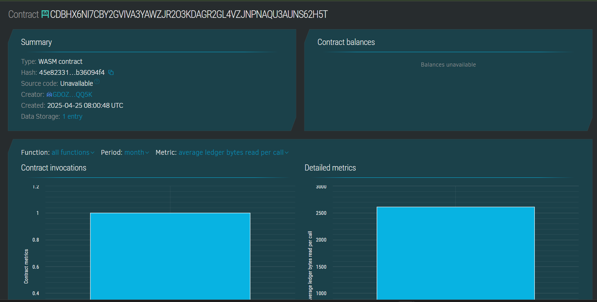

# Portfolio Website for Artists and Creatives

## Project Description
This smart contract serves as the backend logic for a decentralized portfolio website, allowing artists and creatives to showcase their work. Each artist can create a personal profile including a bio and a link to their work (e.g., image, video, or gallery). The platform stores and retrieves artist portfolios securely and immutably using Soroban smart contracts.

## Project Vision
To provide an open, censorship-resistant, and decentralized platform where artists can display their creative work without relying on centralized web hosting or platforms. This ensures data ownership, transparency, and verifiability.

## Key Features
- *Create Portfolio:* Artists can register their portfolio by submitting their name, bio, and art URL.
- *Retrieve Portfolio:* Users can fetch any artist’s portfolio using their unique ID.
- *Track Total Portfolios:* A function that returns the total number of portfolios registered on the platform.

## Future Scope
- *Social Engagement:* Add features like likes, comments, and follows.
- *NFT Integration:* Allow artists to tokenize their art and sell it as NFTs.
- *Curation Tools:* Introduce categories, tags, and search functionalities.
- *Multi-language Support:* To accommodate artists globally.
- *Mobile App Extension:* Companion DApp for easy access on mobile devices.
## Contract Details 
CDBHX6NI7CBY2GVIVA3YAWZJR2O3KDAGR2GL4VZJNPNAQU3AUNS62H5T
